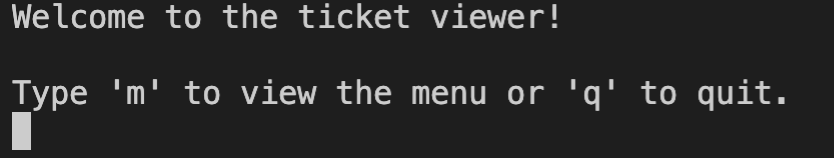
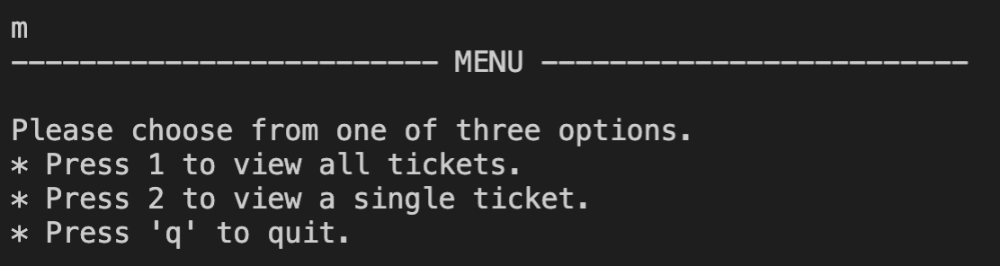
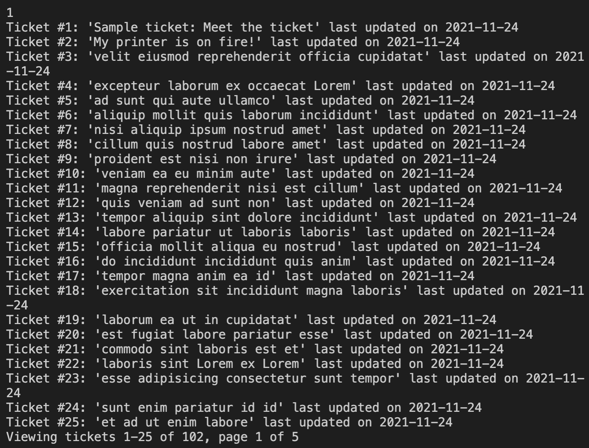

# ZendeskCodingChallenge

This is a program developed for Zendesk's Coding Challenge 2021

## Installation

To install this project clone the repository using `git clone https://github.com/komi-alasse/ZendeskCodingChallenge.git` from the command line.

Then install the necessary requirements using `pip install -r requirements.txt`.

## Usage

To use this project simply input the necessary credentials (url, email, api key) for your Zendesk account into `credentials.env` to enable API access.

Then after that you can run `python main.py`.

You should be prompted to input 'm' to see the menu or 'q' to quit the application, to view your options input 'm'.

From the menu you can input '1' to display all the tickets for your account which will show the tickets in a paginated manner.

You can enter an appropriate page number to view a different page of tickets or 'b' to go back to the menu.

You can also input '2' to display the details of a single ticket in which you will be prompted for a ticket ID number.

You can then enter the ticket ID number to view the details of that particular ticket.

At any point in time you can press 'b' to go back to the menu and, from there, view your options or press 'q' to quit from the menu.
